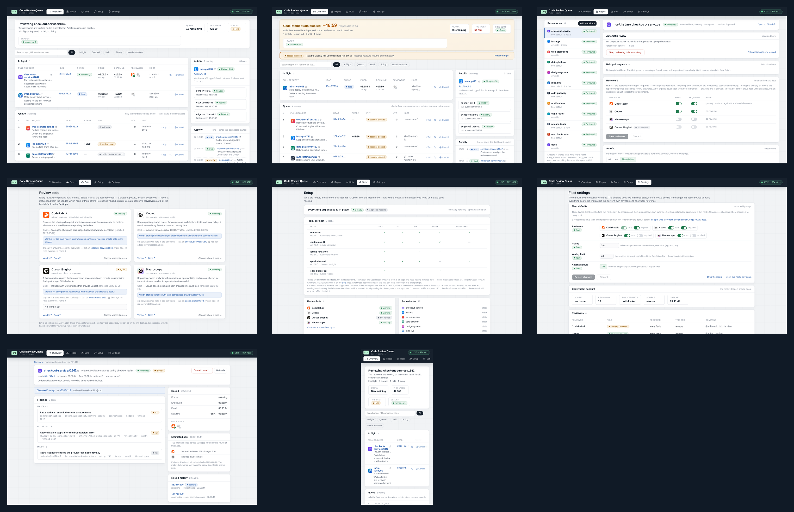

# Dashboard screenshots

The committed dashboard SPA and its real CSS/components, rendered against an
isolated fictional API fixture for public documentation and website work. No
repository, pull request, host, path, or fleet state in these images comes from
a real crq installation. Desktop captures are 2× (2880 × 1800), and the mobile
capture is 3× (1290 × 2796), so they stay sharp when embedded at their CSS size.
Reviewer artwork is the real public GitHub App avatar for CodeRabbit, Codex,
Cursor Bugbot, and Macroscope; repository identities and icons are fictional.

## Assets

- `overview-busy.png`: active review, queue, hold, autofix, and activity
- `overview-quota.png`: metered quota block with co-review and autofix continuing
- `repositories.png`: twelve repositories with distinct identities and policies
- `reviewers.png`: reviewer registry with six reviewer and preflight profiles
- `fleet-computers.png`: five Linux, macOS, and Windows hosts
- `settings.png`: review, autofix, queue, and runtime policy
- `pull-request-findings.png`: detailed review round with three findings and pricing
- `overview-mobile.png`: mobile overview
